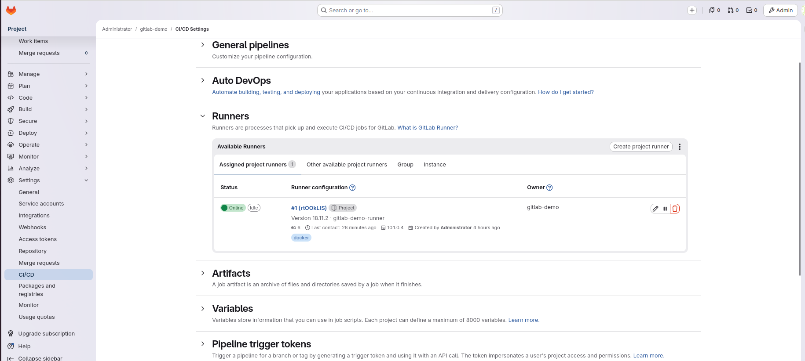
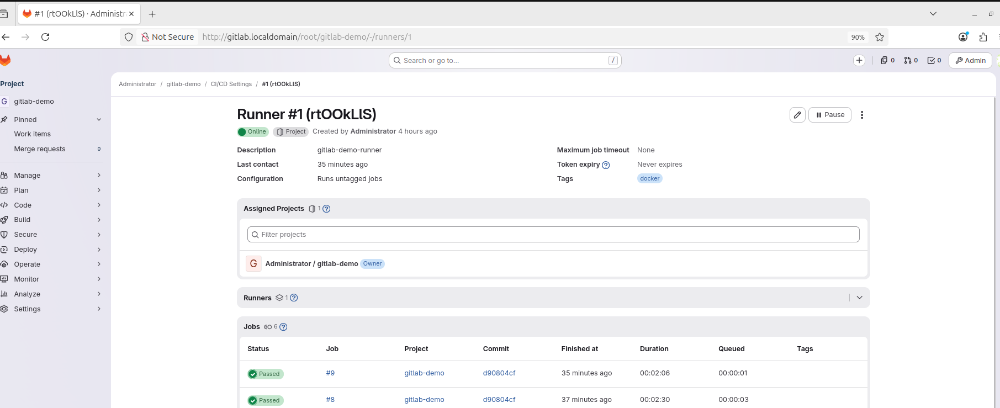
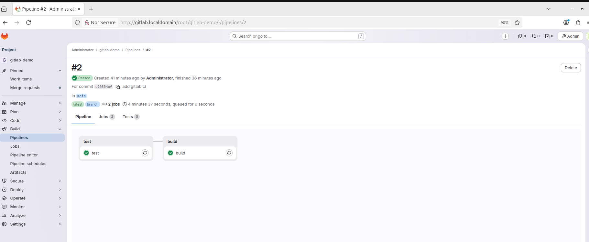

## Дополнительные материалы для выполнения домашних заданий из блока "Введение в DevOps"


- [Дополнительный материал для занятия "8.2. Что такое DevOps. СI/СD"](CICD/8.2-hw.md)

- [Дополнительный материал для занятия "8.3. GitLab"](https://github.com/netology-code/sdvps-materials/tree/main/gitlab)

# Домашнее задание 07-07 GitLab

## Задание 1

GitLab развернут локально на виртуальной машине Ubuntu.

Создан проект `gitlab-demo`.

GitLab Runner зарегистрирован для проекта и запущен в Docker-режиме.

Runner находится в статусе `Online`.

Скриншоты с настройками runner:

Runner settings





---

## Задание 2

Репозиторий был запушен в локальный GitLab после изменения `origin`.

Команды:

```bash
git remote set-url origin http://gitlab.localdomain/root/gitlab-demo.git
git push -u origin main
```

Файл `.gitlab-ci.yml`:

```yaml
stages:
  - test
  - build

test:
  stage: test
  image: golang:1.17
  script:
    - go test .

build:
  stage: build
  image: docker:latest
  script:
    - docker build .
```

Pipeline успешно выполнен.

Jobs `test` и `build` завершились успешно.

Скриншот успешного pipeline:


